# Краткая характеристика

* Наименование программы: **BGFinder** (Board Game Finder) - поиск настольной игры.
* Назначение программы: программа предназначена для **автоматизации и упрощения** поиска различных настольных игр как для компании, так и для одного человека.
* Конечные пользователи: **пользователи интернета**.

# Техническое задание

Порой бывает что компании нечем заняться. С этим может помочь **BGFinger**. Программа принимает различные данные о том какую настольную игру хочет увидеть пользователь и по полученным данным выполняет поиск в **своей базе данных**.
Если в базе данных **BGFinder** есть игра, которая подходит по **всем** критериям - название и её краткое описание выводятся на экран.

### Поиск игр

Для поиска подходящей игры программе нужны некоторые данные о ней (хотя-бы одно):
1. Количество игроков (например 2-4 или 5)
2. Сложность игры (легкая, средняя и сложная)
3. Длительность одной игры (например 110-150 мин.)
4. Рекомендованному для игры возрасту (например 4+)

# Сборка и запуск
Разработка и тестирование программы было осуществлено в операционной системе **Windows 10**. Для успешного запуска и нормальной работы должно быть установлено следующее программное обеспечение:

+ язык **Python 3.10**
+ библиотека **PyQt 5.15.9**

# Функциональные возможности

Программа GFinder автоматизирует, упрощает, и значительно ускоряет процесс поиска нужной настольной игры именно для вас.
Предоставляя название, краткое описание, количество игроков, сложность игры, длительность одной игровой партии и картинку.

# Интерфейс программы

Интерфейс программы разделен на два вида виджетов:
1. Виджеты ввода информации (для поиска игр)
2. Виджеты для вывода информации (вывод текста и картинок на экран)
3. Другие (кнопка поиска)

## Главное стартовое окно программы

## Ввод информации

1. 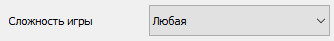

Данный виджет отвечает за сортировку настольных игр при поиске по уровню сложности правил. Будут находиться **только** игры с **указанной** сложностью.

2. 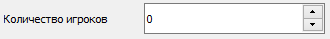

Этот виджет отвечает за ввод числа игроков которое будет сортировать игры при поиске. Будут находиться только те игры для которых нужно введенное количество игроков (например если было введено число 5 то будут найдены игры как 5-10, так и 2-5). **Важно** что изначальное **значение = 0** при поиске с этим значением **параметр количества игроков игнорируется** т.е. при **значении = 0** будут найдены **все результаты** (если этому не мешают другие параметры).

3. 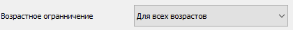

Этот виджет отвечает за сортировку по возрастному ограничению для этой игры. При поиске будут найдены **все** игры возрастное ограничение которых **больше или равно введенному** (например если был выбран возраст **7+** то будут найдены игры **как 7+, так и 16+**).

4. 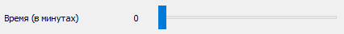

Этот виджет отвечает за сортировку игр по длительности **одной игровой партии**

5. 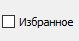

Этот виджет отвечает за сортировку по нахождению игры в избранном. Если **выключено**, то при поиске будут найдены только те игры, которые пользователь **добавил в избранное**, а **если выключено**, то будут показаны **все игры** независимо от того находятся ли они в избранном (если этому не мешают другие параметры).

## Вывод информации

1. 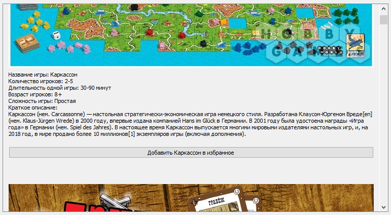

Этот виджет отвечает за вывод текста описывающего игру, изображения к ней и кнопки для добавления в избранное.

2. 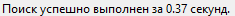

Виджет выводит информацию о скорости поиска в левом нижнем углу экрана.

## Другое

1. 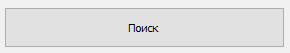

Кнопка при нажатии на которую выполняется поиск игр по критериям задаваемым через виджеты ввода.

2. 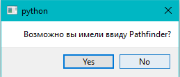

Диалоговое окно вызываемое в случае того что программа ничего не нашла по запросу пользователя, но он ввел название игры которое содержало в себе ошибку. Это окно вызывается лишь в том случае если коэффициент схожести названия введенного пользователем совпадает хотя-бы с одним из бд на > 50%.

3. 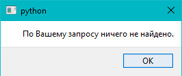

Окошко уведомляющее пользователя о том что по его запросу ничего не найдено.

4. 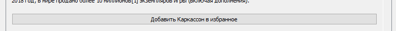

Кнопка добавляющая игру в избранное.
